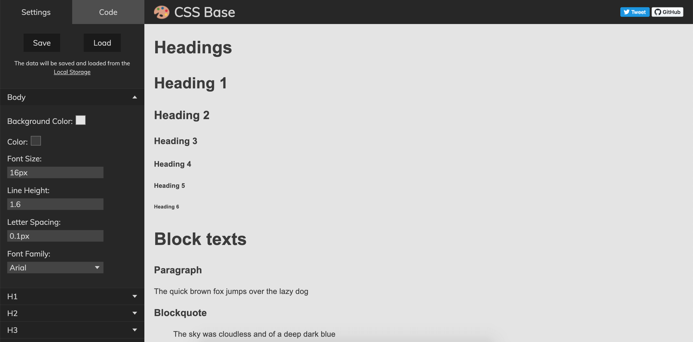

<h1 align="center">
  
  CSS Base theme generator
</h1>

  

## About 

An online tool to quickly prototype and generate a base CSS theme for your project.

## How to use

- Change necessary options;
- Click on the text to edit;
- Review generated code;
- Copy the code to clipboard;
- Paste it in to your project.

## Tech stack

This project is made entirely with HTML, CSS and Vanilla JavaScript.

It is bundled with [parceljs.org](https://parceljs.org/), deployed and hosted at GitHub Pages: [https://nikitahl.github.io/css-base/](https://nikitahl.github.io/css-base/).

## Code of Conduct

Please read and follow the [Code of Conduct](./CODE_OF_CONDUCT.md).

## Contributing

This project is open for contributions. Read the [contributing guide](./CONTRIBUTING.md) to learn about development process. How to integrate your changes to CSS Base.

## License

CSS Base is [MIT licensed](./LICENSE).
